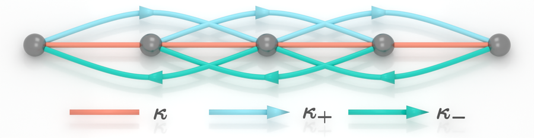
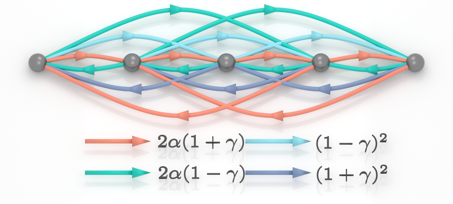
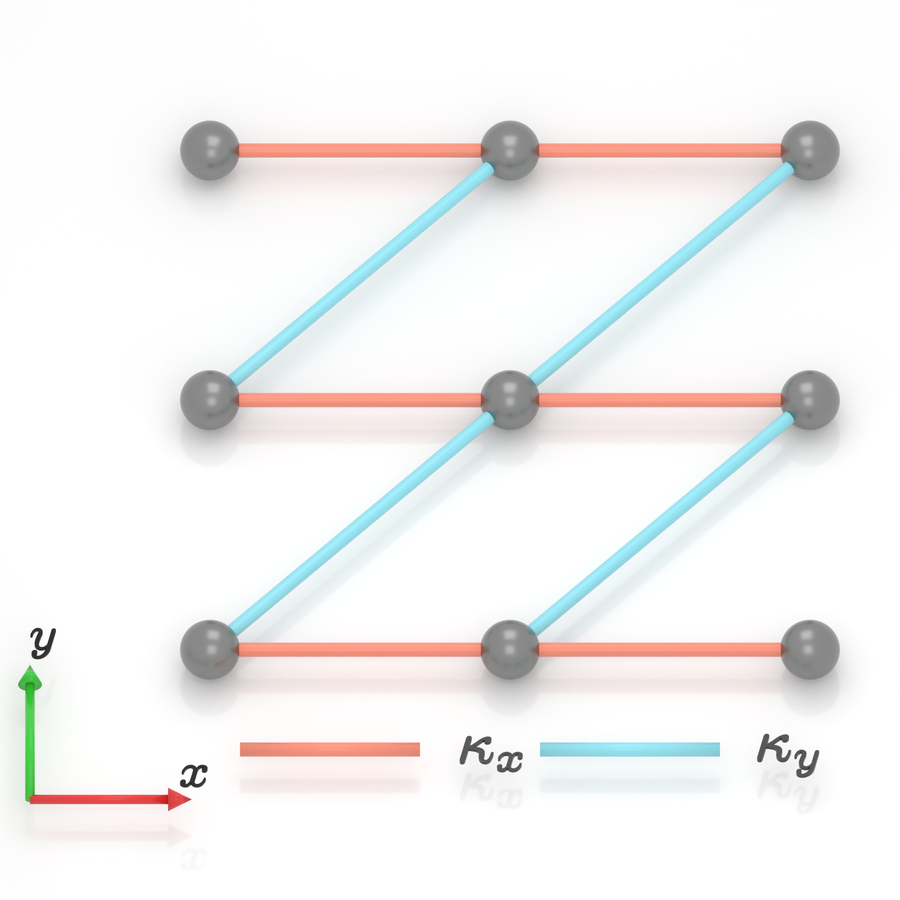
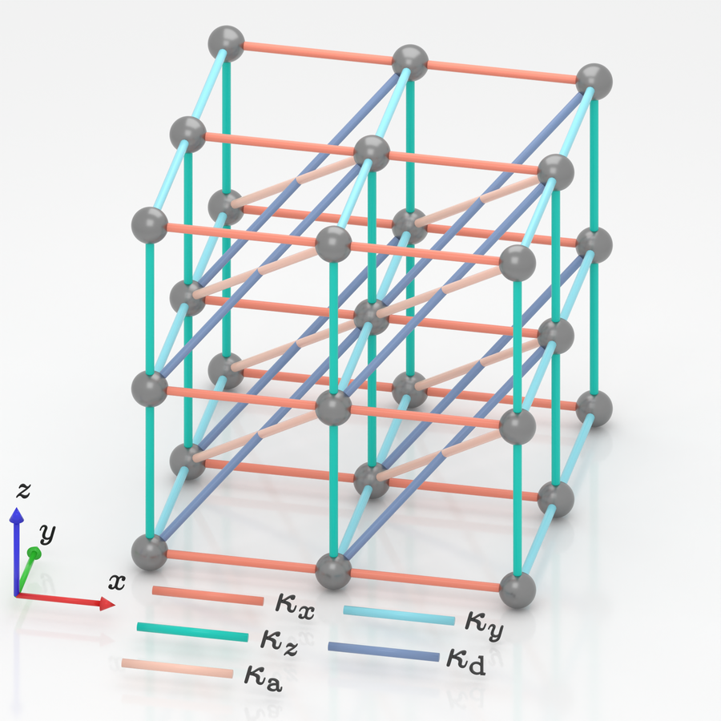

# BlenderTBM

**Publication-quality 3D visualization for Tight-Binding Models using Blender.**


**BlenderTBM** is a lightweight Python framework designed for condensed matter physicists. 
It bridges the gap between abstract physics definitions (sites, hoppings) and high-quality 3D rendering.

Instead of manually dragging objects in 3D software or settling for flat 2D plots, you can **define your lattice using Python code** and let Blender's Cycles engine render **high-quality illustrations**.

## Examples 

| Render Result | Configuration Source |
| :---: | :--- |
|  | **1D Long-range nonreciprocal model**<br>📄[`configs/config_1D_Range2.py`](configs/config_1D_Range2.py) |
|  | **1D Long-range nonreciprocal model**<br>📄[`configs/config_1D_Range3.py`](configs/config_1D_Range3.py) |
|  | **2D Reciprocal Lattice**<br>📄[`configs/config_2D_Reciprocal.py`](configs/config_2D_Reciprocal.py) |
|  | **3D Reciprocal Lattice**<br>📄[`configs/config_3D_Reciprocal.py`](configs/config_3D_Reciprocal.py) |


## Getting Started

### Prerequisites

1.  **[Blender](https://www.blender.org/)** (Version 5.0 or later recommended).
Tested with version 5.0.
2.  **[latex2blender](https://github.com/ghseeli/latex2blender)** addon.
Needed if you want to generate LaTeX formula meshes.
Tested with version 1.0.7.

### Installation & Run

This project is designed to be edited in an **external editor** (like VS Code) and run inside **Blender**.

1.  **Clone the repository**:
    ```bash
    git clone https://github.com/JiaxinZhong/BlenderTBM.git
    ```

2.  **Open Blender**:
    Open the `BlenderTBM.blend` file included in this repo.

3.  **Setup the Runner**:
    * Go to the **Scripting** tab in Blender.
    * Open `dev_runner.py` in the text editor (or ensure it is already loaded).

4.  **Choose a Configuration**:
    * Open `main.py` in your code editor.
    * Change the `TARGET_CONFIG` variable to match a file in the `configs/` folder (e.g., `config_2D_Reciprocal.py`):
        ```python
        TARGET_CONFIG = "config_2D_Reciprocal"  # Change this to your desired config
        ```

5.  **Render**:
    * Click the **Run Script** (Play icon) button on `dev_runner.py` inside Blender.
    * Check the system console (`Window -> Toggle System Console`) for logs.

## How to Define a Model

To create a new lattice, simply add a new python file in the `configs/` folder.

Please refer to the existing files in the **`configs/`** directory (e.g., `configs/config_1D.py` or `configs/config_2D.py`) for complete examples of how to define lattice parameters, hopping rules, and styles.


## 📂 File Structure

- `BlenderTBM.blend`: The base Blender project file (contains the empty scene context).
- `dev_runner.py`: Helper script to run external Python code inside Blender.
- `main.py`: **Entry Point**. Orchestrates the loading of configurations and the rendering pipeline.
- `preample.tex`: LaTeX preamble for rendering mathematical formulas in legends.
- `assets/`: Representative rendered images.
- `configs/`: **User Area**. Contains different lattice configuration scripts.
    - `config_1D_Range3.py`: Example configuration for a 1D chain model.
    - `config_2D_Reciprocal.py`: Example configuration for a 2D reciprocal lattice.
- `core/`: **System Area**. Core modules for the rendering engine.
    - `color.py`: Pre-defined scientific color palettes (NPG, OkabeIto, etc.).
    - `geometry.py`: Functions to generate lattice sites, curved hoppings, and arrows.
    - `materials.py`: Manages Cycles materials and the `HoppingStyle` class.
    - `legend.py`: Generates 3D legends and parses LaTeX formulas.
    - `render.py`: Handles lighting setups, camera positioning, and output settings.
    - `utils.py`: Helper functions for scene cleanup and collection management.
- `output/`: Default directory for saving rendered images. Note that the output figures will not be tracked by git.
- `tools/`: Utility scripts.
    - `compress_image.py`: Compresses and moves rendered images to the `assets/` folder for README usage.
